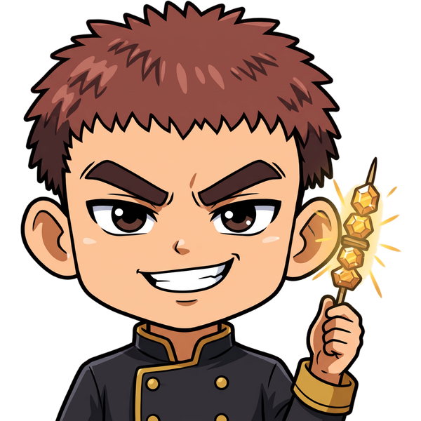
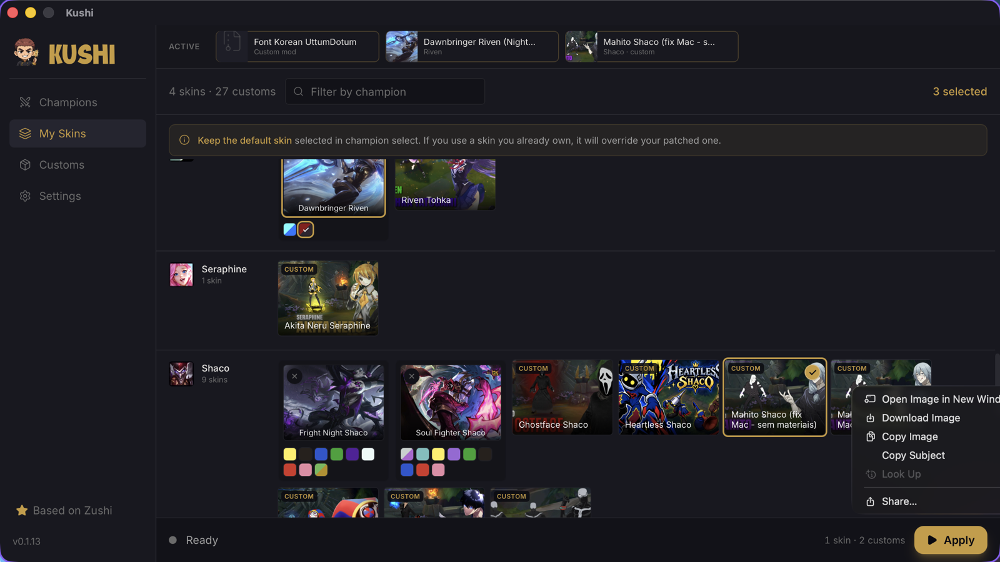

<p align="center">
  
</p>

<h1 align="center">Kushi</h1>

<p align="center">
  
  
  
  
</p>

<p align="center">
  A macOS app to browse and apply League of Legends skins, with custom mods treated as first-class skins.<br/>
  Fork of <a href="https://github.com/Mouadzz/zushi">Zushi</a> by Mouadzz.
</p>

---

<p align="center">
  
</p>

## Why we forked

Zushi gets the hard parts right: a working macOS patcher (built on cslol-manager's tools) and an always-current skin catalog. We kept both untouched.

What pushed us to fork was everything around custom mods, coming from Celestial:

- **Custom mods had no pictures.** Every `.fantome` showed the same generic file icon, even when the mod ships its own preview image.
- **Customs lived in their own tab with independent toggles.** Nothing stopped two Shaco skins (one official, one custom) from being active at once, and you had to check two tabs to know what would actually be applied.
- **Older mods crashed the game.** After a recent patch, League reads asset paths in `.bin` files as hashed `file` values instead of strings. Mods built before that die on load with `FATAL ERROR. Missing data`. Celestial silently fixes this on import; Zushi did not.
- **Skins from divineskins.gg only install through Celestial.** Keeping two managers in sync by hand got old fast.

## What's different

| | Zushi 0.1.13 | Kushi |
|---|---|---|
| Custom mod cards | Generic icon + file name | Preview image from the mod (`META/image.png`, thumbnails, any png/jpg/webp), champion splash as fallback, name and author from `info.json` |
| Selection | One skin per champion for official skins; customs toggled freely | One skin per champion across official skins **and** customs. Picking anything for a champion replaces what was active |
| Where customs show up | Customs tab only | Grouped by champion in the Customs tab **and** inside each champion's row in My Skins |
| What is active | Split across two tabs | An **Active** bar with a thumbnail of everything that will be applied, one click to remove |
| Outdated mods | Applied as-is (can crash on load) | Repaired for the installed patch right before applying |
| Celestial / Divine Skins | Manual export and import | Skins installed with "Open in Celestial" appear in Kushi on their own, with their thumbnail |
| Bulk import | Every imported mod enabled | Bulk imports stay off, so you choose; a single import is enabled for its champion |

### Patch repair

Before a mod goes to the patcher, Kushi reads the `.bin` files of the matching game WAD (for example `Champions/Shaco.wad.client`) to learn which fields the installed patch stores as `file` (per class and field). It then rewrites string asset paths in those fields to their `xxh64` path hash. This works for packed WADs and raw WAD folders.

- Original mod files are never modified. Repaired copies are cached per mod and per game WAD version, so a new patch triggers a fresh repair from the original.
- Mods that are already compatible are passed through untouched.
- On the mods we tested (Mahito Shaco, Yone Zenitsu, Soul Fighter Yasuo WR port), the output matches Celestial's own migration bin for bin.

Implementation: [`src-tauri/src/commands/repair.rs`](src-tauri/src/commands/repair.rs), using LeagueToolkit's `ltk_meta` and `ltk_wad`.

### Celestial bridge

Kushi watches Celestial's local library (`~/Library/Application Support/com.divineskins.celestial/storage`) every few seconds. New Divine skins, including the newer `.modpkg` format, are packed into regular `.fantome` files with their thumbnail and show up under their champion. A single new skin is selected right away.

- Only files Celestial already downloaded are read. Kushi never talks to the Divine Skins API.
- Removing a synced skin in Kushi keeps it removed.
- Celestial stays installed as the downloader. You don't need to open it to apply anything.

Implementation: [`src-tauri/src/commands/celestial.rs`](src-tauri/src/commands/celestial.rs).

## Building

There are no Kushi releases yet. Build it from source on an Apple Silicon Mac:

**Requirements:** Rust (stable), Node 20+, CMake, Xcode Command Line Tools.

```sh
# 1. Build the patcher (mod-tools)
cmake -S mod-tools -B mod-tools/build -DCMAKE_BUILD_TYPE=Release -DCMAKE_OSX_ARCHITECTURES=arm64
cmake --build mod-tools/build -j$(sysctl -n hw.ncpu)
mkdir -p src-tauri/binaries
cp mod-tools/build/mod-tools src-tauri/binaries/mod-tools-aarch64-apple-darwin

# 2. Build the app
npm ci
npx tauri build --bundles app

# 3. Install
cp -R src-tauri/target/release/bundle/macos/Kushi.app /Applications/
xattr -cr /Applications/Kushi.app
```

Kushi keeps Zushi's bundle identifier (`com.zushi.app`) on purpose, so an existing Zushi install carries over its downloaded skins, customs and settings. Don't run both apps at once.

## Usage

1. **Open the League client** and leave it running.
2. **Open Kushi.** It asks for your password once: the patcher needs root to attach to the game.
3. **Pick skins.** Download official skins from Champions, import `.fantome`/`.zip` mods in Customs, or install from divineskins.gg with "Open in Celestial". Choose one per champion in My Skins and click **Apply**.
4. **Play.** With the status on **Waiting for game**, queue up. Keep the default skin selected in champion select.

## Staying in sync with Zushi

`upstream` points to [Mouadzz/zushi](https://github.com/Mouadzz/zushi). Patcher fixes land there first:

```sh
git fetch upstream
git merge upstream/main
```

Kushi's changes sit mostly in their own files (`repair.rs`, `celestial.rs`, `mod_info.rs`, `CustomCard.tsx`, `ActiveBar.tsx`, `Thumbs.tsx`), so merges tend to be small. If upstream changes `mod-tools`, rebuild it (step 1 above).

## Disclaimer

Kushi is not endorsed by Riot Games and does not reflect the views or opinions of Riot Games or anyone officially involved in producing or managing Riot Games properties. Riot Games and all associated properties are trademarks or registered trademarks of Riot Games, Inc.

Skins are visible only to you and do not affect gameplay or provide any competitive advantage. Use at your own risk.

## License

MIT, same as upstream. See [LICENSE](LICENSE). Original work © Mouadzz.

## Credits

- [Zushi](https://github.com/Mouadzz/zushi) by Mouadzz: the app this is built on
- [cslol-manager](https://github.com/LeagueToolkit/cslol-manager): modding tools behind the patcher
- [LeagueToolkit](https://github.com/LeagueToolkit): `ltk_meta`, `ltk_wad` and `ltk_modpkg`, used for patch repair and `.modpkg` support
- [LeagueSkins](https://github.com/Alban1911/LeagueSkins): the skin catalog
- [Divine Skins](https://divineskins.gg) and Celestial: where many custom skins come from
